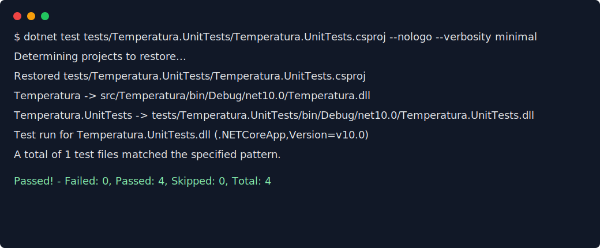
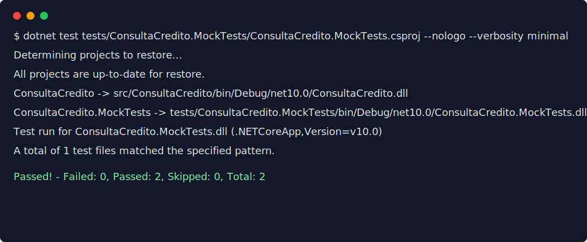

# Aplicando Testes

Repositório criado para aplicar os exemplos do tutorial [Testes de Software com .NET 5: exemplos de utilização](https://renatogroffe.medium.com/testes-de-software-com-net-5-exemplos-de-utiliza%C3%A7%C3%A3o-9b5514119ba2), organizando os três tipos de testes apresentados: testes de unidade, Mock Objects e SpecFlow/BDD.

> Observação: o projeto foi executado localmente com o SDK .NET 10 instalado na máquina, mantendo a estrutura e as bibliotecas do tutorial onde aplicável.

## Testes de Unidade

Os testes de unidade validam uma regra pequena e isolada do sistema. Neste projeto, a regra testada é a conversão de temperaturas de Fahrenheit para Celsius, seguindo o exemplo do tutorial. O teste usa xUnit com `Theory` e `InlineData`, permitindo executar a mesma verificação com diferentes entradas e saídas esperadas.

Cenário 1: ao informar `32°F`, o conversor deve retornar `0°C`, que representa o ponto de congelamento da água.

Cenário 2: ao informar `212°F`, o conversor deve retornar `100°C`, que representa o ponto de ebulição da água.

## Mock Objects

Mock Objects simulam o comportamento de dependências externas para testar apenas a regra de negócio que está sob análise. Neste projeto, `AnaliseCredito` depende de `IServicoConsultaCredito`; os testes usam Moq para controlar o score retornado pela consulta e FluentAssertions para validar o resultado com uma escrita mais expressiva.

Cenário 1: quando o CPF consultado retorna score `720` e o valor solicitado está dentro do limite automático, a análise deve aprovar o crédito.

Cenário 2: quando o CPF consultado retorna score `420`, a análise deve reprovar o crédito por score insuficiente.

## Barema

(De 0 a 3) - Implementação dos 3 tipos de testes apresentados no artigo (1 ponto para cada tipo de teste implementado)

(De 0 a 2) - Explicação clara e objetiva sobre a aplicação dos testes

(De 0 a 2) - Organização do arquivo readme, com imagens dos testes e coerência dos textos.
